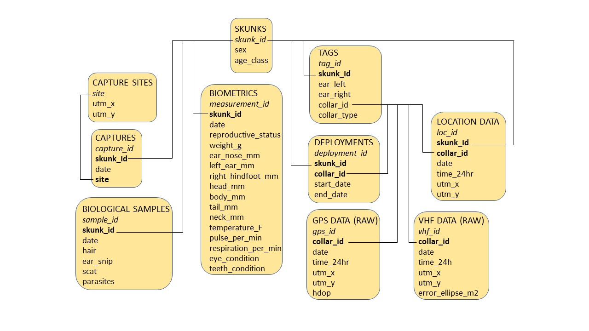

# Relational Database 

This chapter documents the creation of a relational database in partial fulfillment of the RDS 2023 course requirements. 

## Designing a Database

Below is an image of the database structure I will to use to host the data for
my final semester project. The diagram describes the tables that will compose my 
database. Primary keys are in **bold** and foreign keys are in *italics*.

```{r design, fig.align='center', out.width='100%', eval = TRUE, echo = FALSE}



```

## Creating the Database

My first step is to create a database and establish a connection between R and SQLite

```{r connect, eval = TRUE, echo = TRUE}

library(DBI) #load package

skunks_db <- dbConnect(RSQLite::SQLite(), "C:/Users/Kara.White/Documents/PhD/resourceSelection/data/skunks.db") #establish db connection

```

## Creating tables

Now that I have created and established a connection to the database I can begin to create tables

```{r skunks, eval = FALSE, echo = TRUE}
#create skunk table

dbExecute(skunks_db, "CREATE TABLE skunks (
skunk_id varchar(10) NOT NULL,
sex char(1) CHECK (sex IN ('M', 'F')),
age_class varchar(8) CHECK (age_class IN ('juvenile', 'subadult', 'adult')),
PRIMARY KEY (skunk_id)
);") 
```

```{r capture sites, eval = FALSE, echo = TRUE}
#create capture sites table
dbExecute(skunks_db, "CREATE TABLE capture_sites (
site varchar(7) NOT NULL PRIMARY KEY,
utm_x double,
utm_y double
);")
```

```{r captures, eval = FALSE, echo = TRUE }
#create captures table
dbExecute(skunks_db, "CREATE TABLE captures (
capture_id INTEGER PRIMARY KEY AUTOINCREMENT,
skunk_id varchar(10),
date text,
site varchar(7),
FOREIGN KEY(skunk_id) REFERENCES skunks(skunks_id)
FOREIGN KEY(site) REFERENCES capture_sites(site)
);")

```

```{r biometrics, eval = FALSE, echo = TRUE}
#create biometrics table
dbExecute(skunks_db, "CREATE TABLE biometrics (
measurement_id INTEGER PRIMARY KEY AUTOINCREMENT,
skunk_id varchar(8),
date text,
reproductive_status char(20),
weight_g float,
ear_nose_mm float,
left_ear_mm float,
right_hindfoot_mm float,
head_mm float,
body_mm float,
tail_mm float,
neck_mm float,
temperature_F float,
pulse_per_min float,
respiration_per_min float,
eye_condition char(10),
teeth_condition varchar(10),
FOREIGN KEY (skunk_id) REFERENCES skunks(skunk_id)
);")
```

```{r biologicals, eval = FALSE, echo = TRUE}
#create biological samples table
dbExecute(skunks_db, "CREATE TABLE biological_samples (
sample_id INTEGER PRIMARY KEY AUTOINCREMENT,
skunk_id varchar(8),
date text,
hair char(1) CHECK (hair IN ('Y', 'N')),
ear_snip char(1) CHECK (ear_snip IN ('Y', 'N')),
scat char(1) CHECK (scat IN ('Y', 'N')),
parasites char(1) CHECK (parasites IN ('Y', 'N')),
FOREIGN KEY (skunk_id) REFERENCES skunks(skunk_id)
);")
```

```{r tags, eval = FALSE, echo = TRUE}
#create tags table
dbExecute(skunks_db, "CREATE TABLE tags (
tag_id INTEGER PRIMARY KEY AUTOINCREMENT,
skunk_id varchar(8),
ear_left char(3),
ear_right char(3),
collar_id varchar(10),
collar_type char(3),
FOREIGN KEY (skunk_id) REFERENCES skunks(skunk_id)
);")
```

```{r deployments, eval = FALSE, echo = TRUE}
#create deployments table
dbExecute(skunks_db, "CREATE TABLE deployments (
deployment_id INTEGER PRIMARY KEY AUTOINCREMENT,
skunk_id varchar(8),
collar_id varchar(10),
start_date text,
end_date text,
FOREIGN KEY (skunk_id) REFERENCES skunks(skunk_id)
FOREIGN KEY (collar_id) REFERENCES tags(collar_id)
);")
```

```{r gps, eval = FALSE, echo = TRUE}
#create gps_data_raw table
dbExecute(skunks_db, "CREATE TABLE gps_data_raw (
gps_id INTEGER PRIMARY KEY AUTOINCREMENT,
collar_id varchar(10),
date text,
time_24hr text,
utm_x double,
utm_y double,
hdop double,
FOREIGN KEY(collar_id) REFERENCES tags(collar_id)
);")
```

```{r vhf, eval = FALSE, echo = TRUE}
#create vhf_data_raw table
dbExecute(skunks_db, "CREATE TABLE vhf_data_raw (
vhf_id INTEGER PRIMARY KEY AUTOINCREMENT,
collar_id varchar(10),
date text,
time_24hr text,
utm_x double,
utm_y double,
error_ellipse_m2 double,
FOREIGN KEY(collar_id) REFERENCES tags(collar_id)
);")
```

```{r locations, eval = FALSE, echo = TRUE}
#create location data table
dbExecute(skunks_db, "CREATE TABLE location_data (
loc_id INTEGER PRIMARY KEY AUTOINCREMENT,
skunk_id varchar(8),
collar_id varchar(10),
date text,
time_24hr text,
utm_x double,
utm_y double,
FOREIGN KEY (skunk_id) REFERENCES skunks(skunk_id)
FOREIGN KEY(collar_id) REFERENCES tags(collar_id)
);")
```

## Reading in CSVs

Now that I have finished creating all of the tables as shown in 1.1 I can load the data that I will use to populate the tables

```{r csvs, eval = TRUE, echo = TRUE}

skunks <- read.csv("~/PhD/resourceSelection/data/skunks.csv", stringsAsFactors = F)
capture_sites <- read.csv("~/PhD/resourceSelection/data/capture_sites.csv", stringsAsFactors = F)
captures <- read.csv("~/PhD/resourceSelection/data/captures.csv", stringsAsFactors = F)
biometrics <- read.csv("~/PhD/resourceSelection/data/Biometrics.csv", stringsAsFactors = F)
biological_samples <- read.csv("~/PhD/resourceSelection/data/samples.csv", stringsAsFactors = F)

```

Before I populate the tables I will check to make sure column names match the ones in the tables I created and rearrange columns so that they appear in the right order

```{r check, eval = TRUE, echo = TRUE}

names(skunks) 
names(capture_sites)

```

The first two CSVs have columns with correct names and in the correct order, but I will need to add auto-incremental columns and then re-order the columns for the remaining CSVs.

```{r edit, eval = TRUE, echo = TRUE, message = FALSE}
library(dplyr)

captures$capture_id <- 1:nrow(captures) #add column
head(captures, 2) #check column added
captures <- captures[, c("capture_id", "skunk_id", "date", "site")] #reorder columns

biometrics$measurement_id <- 1:nrow(biometrics) #add column
head(biometrics, 2) #check column added
biometrics <- biometrics %>% select(measurement_id, everything()) #reorder columns
head(biometrics, 2) #check columns are re-ordered

biological_samples$sample_id <- 1:nrow(biological_samples) #add column
head(biological_samples, 2) #check column added
biological_samples <- biological_samples %>% select(sample_id, everything()) #reorder columns
head(biological_samples, 2) #check columns are re-ordered
```
## Populating database tables

Now that I have checked that all column names match the column names I assigned when creating the tables I can insert the data into the tables

```{r append, eval = FALSE, echo = TRUE}
#add data from csv into captures table
dbWriteTable(skunks_db, "skunks", skunks, append = T)

#add data from csv into capture_sites table
dbWriteTable(skunks_db, "capture_sites", capture_sites, append = T)

#add data from csv into captures table
dbWriteTable(skunks_db, "captures", captures, append = T)

#add data from csv into biometrics table
dbWriteTable(skunks_db, "biometrics", biometrics, append = T)

##add data from csv into biological samples table
dbWriteTable(skunks_db, "biological_samples", biological_samples, append = T)

```

## Querying the database

Now that I have inserted data into the table, I can make basic queries to check that the data has been inserted into the tables correctly

```{r skunk query, eval = TRUE, echo = TRUE}
dbGetQuery(skunks_db, "SELECT * FROM skunks LIMIT 10;") #skunks table
```

```{r capture site query, eval = TRUE, echo = TRUE}
dbGetQuery(skunks_db, "SELECT * FROM capture_sites LIMIT 10;") #capture sites table
```

```{r captures query, eval = TRUE, echo = TRUE}
dbGetQuery(skunks_db, "SELECT * FROM captures LIMIT 10;") #captures table

```

```{r biometrics query, eval = TRUE, echo = TRUE}
dbGetQuery(skunks_db, "SELECT * FROM biometrics LIMIT 10;") #biometrics table
```

```{r}
dbGetQuery(skunks_db, "SELECT * FROM biological_samples LIMIT 10;") #samples table
```

