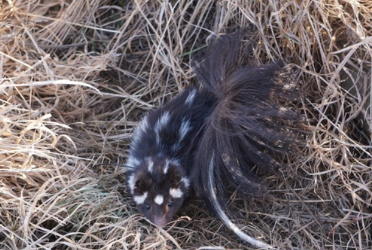

--- 
title: "Plains spotted skunks in South Dakota"
author: "Kara White"
date: "`r Sys.Date()`"
site: bookdown::bookdown_site
documentclass: book
bibliography: [book.bib, packages.bib]
# url: your book url like https://bookdown.org/yihui/bookdown
# cover-image: path to the social sharing image like images/cover.jpg
description: |
  This is my initial attempt using the bookdown package to write a book website
  exploring spotted skunk data in South Dakota as part of the
  RDS 2023 course requirements.
  The HTML output format for this example is bookdown::gitbook,
  set in the _output.yml file.
link-citations: yes
github-repo: rstudio/bookdown-demo
---

# Overview {-}

The plains spotted skunk is a small (i.e., ≤1 kg) carnivore native to central North America with a historical distribution extending from the southern plains
of Manitoba, Canada to the coastal plains of Tamaulipas, Mexico, and east-west from the Mississippi River to the Rocky Mountains. 

```{r image, fig.cap= "photo by Danni Brosend", fig.align='center', out.width='100%', eval = TRUE, echo = FALSE}



```

Long-term harvest trends of spotted skunks east of the Rocky Mountains indicated a >90% reduction in populations. Causes for the reduction have not been identified, but intensified land-use practices that reduce habitat via agricultural expansion, decrease prey abundances via widespread use of agricultural pesticides, and increase competition via altered predator communities have been hypothesized. 

Perceived population concerns led to a petition to consider plains spotted skunks under the U.S. Endangered Species Act and the United States Fish and Wildlife Service (USFWS) conducted a species status assessment of the plains spotted skunk. However, there is a paucity of information about plains spotted skunks to inform conservation decisions and efforts. Few studies have investigated plains spotted skunks, and even fewer have focused on the northern portion of the species range. 

Follow along with me as I explore spotted skunk data in partial fulfillment of 
the requirements of RDS 2023 course, and as I attempt to address knowledge gaps and inform conservation and management of plains spotted skunks in South Dakota!
